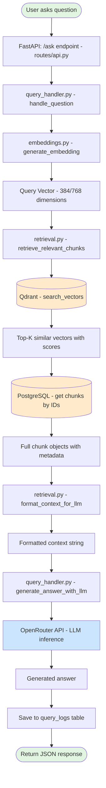
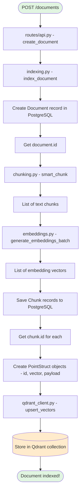
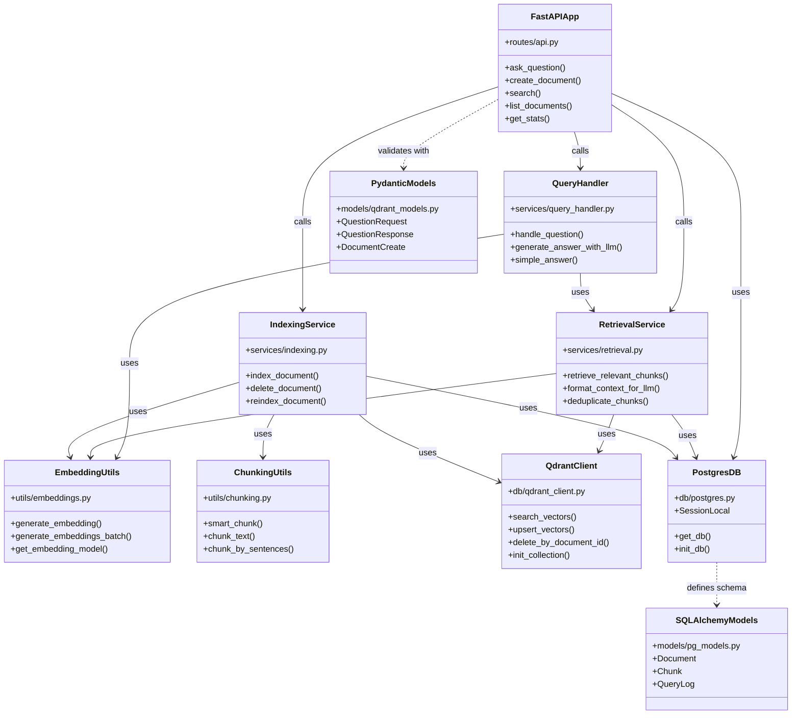
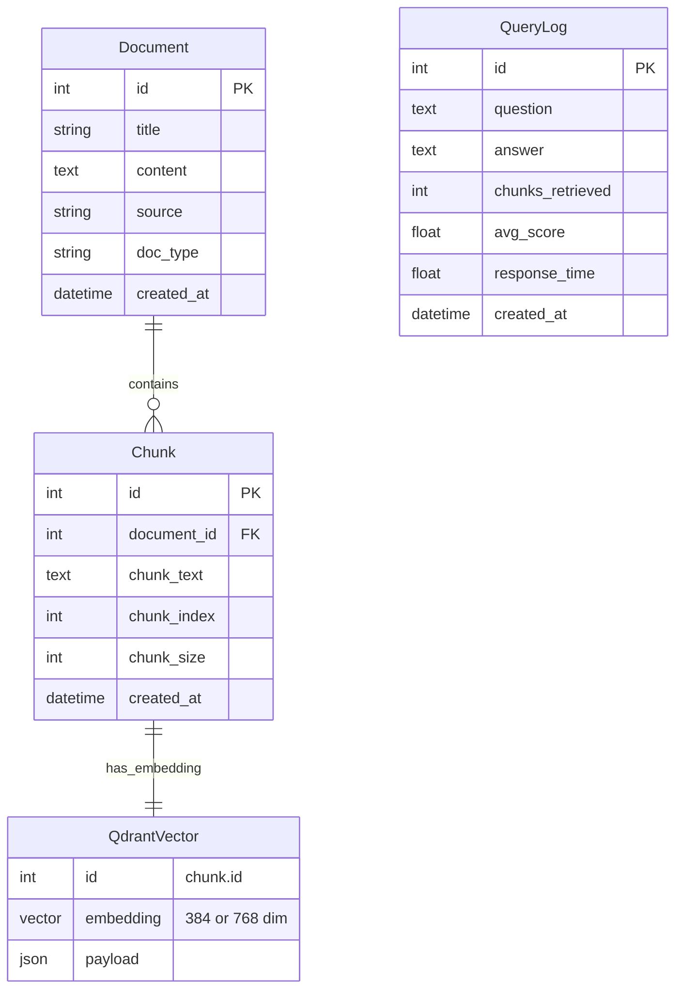
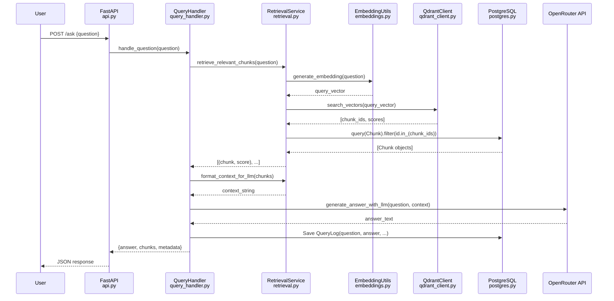
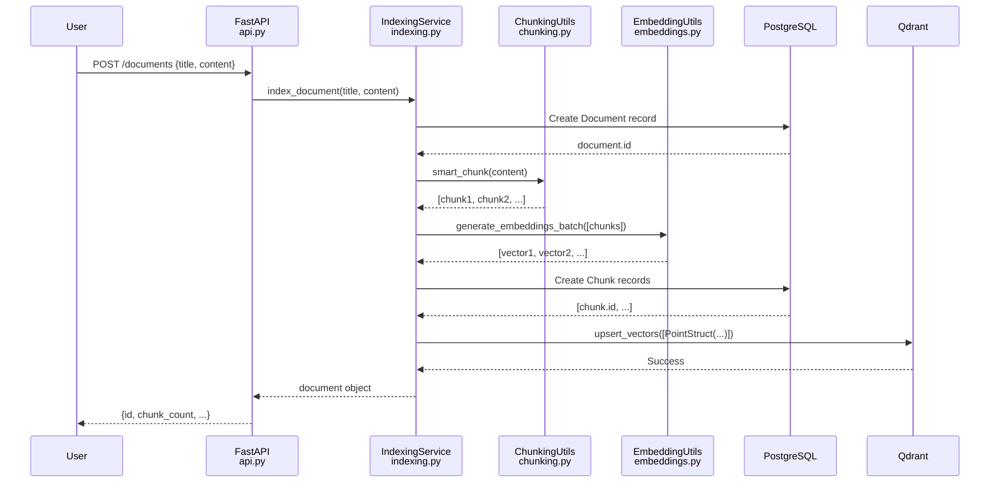
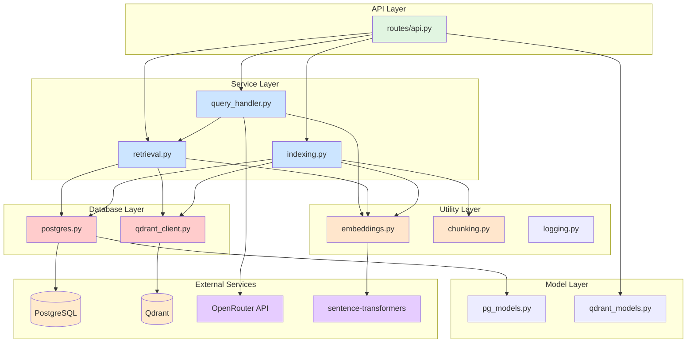

# System Architecture & Flow Diagrams

## 1. Complete RAG Flow - Step by Step



## 2. Document Indexing Flow



## 3. Class and Function Relationships



## 4. Database Schema Relationships



## 5. Detailed RAG Question Flow with Functions



## 6. Document Indexing Sequence



## 7. Component Dependencies



## 8. Function Call Hierarchy - Ask Question

```
routes/api.py::ask_question()
│
├─► services/query_handler.py::handle_question()
    │
    ├─► services/retrieval.py::retrieve_relevant_chunks()
    │   │
    │   ├─► utils/embeddings.py::generate_embedding()
    │   │   └─► utils/embeddings.py::get_embedding_model()
    │   │
    │   ├─► db/qdrant_client.py::search_vectors()
    │   │   └─► qdrant_client.search()  [external]
    │   │
    │   └─► db.query(Chunk).filter()  [SQLAlchemy]
    │
    ├─► services/retrieval.py::deduplicate_chunks()
    │
    ├─► services/retrieval.py::format_context_for_llm()
    │
    ├─► services/query_handler.py::generate_answer_with_llm()
    │   └─► requests.post(OpenRouter API)  [external]
    │
    └─► db.add(QueryLog)  [SQLAlchemy]
```

## 9. Function Call Hierarchy - Index Document

```
routes/api.py::create_document()
│
└─► services/indexing.py::index_document()
    │
    ├─► db.add(Document)  [SQLAlchemy]
    │
    ├─► utils/chunking.py::smart_chunk()
    │   ├─► chunking.py::chunk_text()  [if needed]
    │   └─► chunking.py::chunk_by_paragraphs()  [if needed]
    │
    ├─► utils/embeddings.py::generate_embeddings_batch()
    │   ├─► utils/embeddings.py::get_embedding_model()
    │   └─► model.encode()  [sentence-transformers]
    │
    ├─► db.add(Chunk) for each chunk  [SQLAlchemy]
    │
    └─► db/qdrant_client.py::upsert_vectors()
        └─► qdrant_client.upsert()  [external]
```

## 10. Key Function Reference

### API Layer (routes/api.py)
- `ask_question()` - Main RAG endpoint
- `create_document()` - Index new document
- `search()` - Search chunks only
- `list_documents()` - Get all documents
- `get_stats()` - System statistics

### Query Handler (services/query_handler.py)
- `handle_question()` - Complete RAG pipeline
- `generate_answer_with_llm()` - Call OpenRouter
- `simple_answer()` - Direct LLM (no RAG)

### Retrieval (services/retrieval.py)
- `retrieve_relevant_chunks()` - Vector search + fetch
- `format_context_for_llm()` - Format chunks for prompt
- `deduplicate_chunks()` - Remove duplicates
- `search_chunks_by_text()` - Text-based search

### Indexing (services/indexing.py)
- `index_document()` - Full indexing pipeline
- `delete_document()` - Remove document
- `reindex_document()` - Re-process document
- `get_indexing_stats()` - Get statistics

### Embeddings (utils/embeddings.py)
- `generate_embedding()` - Single text embedding
- `generate_embeddings_batch()` - Batch processing
- `get_embedding_model()` - Model singleton
- `cosine_similarity()` - Similarity calculation

### Chunking (utils/chunking.py)
- `smart_chunk()` - Intelligent chunking
- `chunk_text()` - Character-based
- `chunk_text_by_sentences()` - Sentence-based
- `chunk_text_by_paragraphs()` - Paragraph-based

### Qdrant Client (db/qdrant_client.py)
- `init_collection()` - Create collection
- `search_vectors()` - Similarity search
- `upsert_vectors()` - Insert/update vectors
- `delete_by_document_id()` - Delete vectors

### PostgreSQL (db/postgres.py)
- `get_db()` - Database session
- `init_db()` - Create tables
- `SessionLocal` - Session factory

## 11. Data Flow Summary

```
INPUT (Question)
      ↓
[Embedding Generation] → Vector (384/768 dims)
      ↓
[Vector Search] → Qdrant finds similar chunks
      ↓
[Metadata Fetch] → PostgreSQL gets full chunks
      ↓
[Context Formation] → Format chunks into prompt
      ↓
[LLM Generation] → OpenRouter generates answer
      ↓
OUTPUT (Answer + Sources)
```

## 12. Module Interaction Map

```
┌─────────────────────────────────────────────────────┐
│                    FastAPI App                       │
│                    (main.py)                        │
└────────────────┬───────────────────────────────────┘
                 │
    ┌────────────┴────────────┐
    ▼                         ▼
┌─────────┐              ┌──────────┐
│   API   │              │   DB     │
│ Routes  │◄────────────►│  Init    │
└────┬────┘              └──────────┘
     │
     ├──► Query Handler ──┬──► Retrieval ──┬──► Qdrant Client
     │                    │                 └──► PostgreSQL
     │                    │
     │                    └──► Embeddings ──► sentence-transformers
     │
     └──► Indexing ───────┬──► Chunking
                          ├──► Embeddings
                          ├──► PostgreSQL
                          └──► Qdrant Client
```